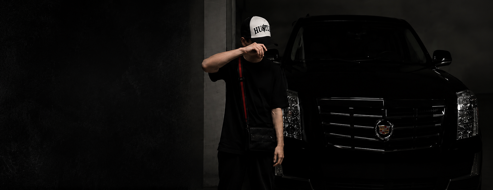

# 🎯 ФИНАЛЬНАЯ ИСТОРИЯ ПРОЕКТА HUSTLE

## 📋 ЧТО БЫЛО СДЕЛАНО

Создан premium e-commerce сайт **HUSTLE** - интернет-магазин кепок с luxury streetwear атмосферой.

---

## 🏗️ ФИНАЛЬНАЯ СТРУКТУРА

### HTML структура (index.html)
```
<body>
  <section class="hero">
    
    <header class="header">
      <!-- Меню поверх фото -->
    </header>
    
  </section>
  
  <section class="benefits">
    <!-- 4 бенефита -->
  </section>
  
  <section class="collection">
    <!-- 6 кепок -->
  </section>
  
  <section class="black-section">
    <!-- Вторая секция с текстом -->
  </section>
  
  <section class="features">
    <!-- 4 feature'а -->
  </section>
  
  <footer>
    <!-- Footer -->
  </footer>
</body>
```

---

## 🎨 КЛЮЧЕВЫЕ CSS РЕШЕНИЯ

### Hero Section
- `position: relative` - контейнер для абсолютно позиционированных элементов
- `height: 780px` - фиксированная высота
- Header с `position: absolute; top: 0; z-index: 100` - поверх фото
- Логотип с `position: absolute; top: 12px; left: 60px; z-index: 50`
- `background.png` - фото во всю высоту с `object-fit: contain`

### Header
- `background-color: transparent` - полностью прозрачный
- `padding: 8px 24px` - минимальные отступы
- Меню (SHOP, COLLECTION, ABOUT, CONTACT) белым цветом

### Benefits
- Сразу после hero БЕЗ промежутков
- `margin: 0; padding: 48px 32px`
- Белый фон (#f5f5f5)
- 4 колонки с иконками

### Palette
- Черный фон: #111111, #1d1d1d
- Белый текст: #ffffff
- Секвичный серый: #999999
- Белый блок бенефитов: #f5f5f5

---

## 📁 ФАЙЛЫ ПРОЕКТА

```
/Users/aleksandrpatanin/Desktop/Claude Code/Сайт с кепками/
├── index.html              ← HTML структура
├── styles.css              ← Все стили (CSS переменные, Grid, Flex)
├── script.js               ← JS для мобильного меню
├── background.png          ← Фоновое изображение (парень с машиной)
├── логотип новый.jpg       ← Логотип (70px height)
├── IMG_8574-8579.JPG       ← Фото кепок (6 штук)
├── IMG_8580.JPG            ← Фото для черной секции
└── ФИНАЛЬНАЯ_ИСТОРИЯ.md    ← Этот файл
```

---

## 🔧 ЧТО РАБОТАЕТ

✅ **Header**
- Логотип (невидимый в HTML, логотип новый.jpg поверх фото)
- Меню: SHOP, COLLECTION, ABOUT, CONTACT
- Иконки: поиск, корзина
- Мобильное меню с hamburger

✅ **Hero Section**
- Фото background.png во всю ширину (780px высота)
- Логотип новый.jpg в левом верхнем углу (top: 12px, left: 60px)
- Меню белым цветом поверх фото
- Фото начинается с самого верха страницы

✅ **Benefits**
- 4 иконки + текст
- Белый фон, черный текст
- Сразу после hero без промежутков

✅ **Collection**
- 6 кепок разных цветов
- Grid: 6 колонок (desktop), 3 (tablet), 2 (mobile)
- NEW badges, wishlist кнопки

✅ **Black Section**
- Фото + текст "ЭТО НЕ ПРОСТО КЕПКА"
- Кнопка "УЗНАТЬ БОЛЬШЕ"

✅ **Features**
- 4 иконки: LIMITED DROP, STREET APPROVED, REAL HUSTLE, JOIN THE MOVEMENT

✅ **Footer**
- Логотип, описание
- Меню, Help, Newsletter
- Социальные иконки

✅ **Адаптивность**
- Mobile: hamburger меню, 2-колонная сетка
- Tablet: 3-колонная сетка
- Desktop: 6-колонная сетка

---

## 🎯 ФИНАЛЬНЫЕ ПАРАМЕТРЫ

| Элемент | Значение |
|---------|----------|
| Hero высота | 780px |
| Логотип top | 12px |
| Логотип left | 60px |
| Логотип height | 70px |
| Header padding | 8px 24px |
| Benefits padding | 48px 32px |
| Основной шрифт | -apple-system, BlinkMacSystemFont, 'Segoe UI' |
| Основной черный | #111111 |
| Основной белый | #ffffff |

---

## 🚀 ДЛЯ СЛЕДУЮЩЕГО СЕАНСА

Если нужно дальше развивать сайт, уже готово:
- ✅ Полная HTML структура
- ✅ CSS с переменными (легко менять цвета)
- ✅ Responsive дизайн
- ✅ Мобильное меню работает
- ✅ Все секции правильно структурированы

**Сервер запускается:**
```bash
cd "/Users/aleksandrpatanin/Desktop/Claude Code/Сайт с кепками"
python3 -m http.server 8000
```

**Открыть в браузере:**
http://localhost:8000

---

## 💡 КЛЮЧЕВЫЕ МОМЕНТЫ

1. **Header поверх фото** - использует `position: absolute` внутри hero
2. **Логотип поверх фото** - отдельный img с абсолютной позицией
3. **No gaps between sections** - benefits начинается БЕЗ margin-top
4. **Image fills hero** - `object-fit: contain` показывает всё фото без обрезки
5. **Mobile menu** - hamburger кнопка с JavaScript toggle

Сайт готов к использованию и дальнейшему развитию! 🎉
